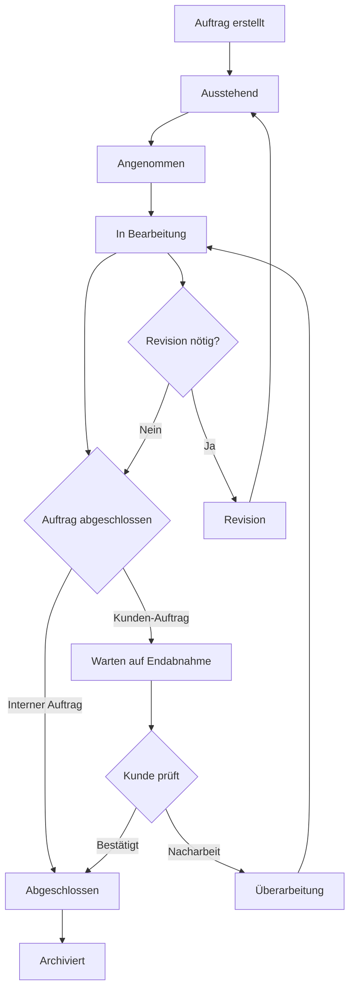

# Match-Werkstatt - Auftragsmanagement System

Ein vollständiges Web-basiertes Auftragsmanagement-System für Werkstätten mit Kunden-Werkstatt-Interaktion, QR-Code-Integration und umfassendem Workflow-Management.

## 🚀 Schnellstart

### Systemvoraussetzungen
- Node.js (Version 16 oder höher)
- MongoDB (lokal oder remote)
- Moderne Browser (Chrome, Firefox, Safari, Edge)

### Installation und Start

```bash
# Abhängigkeiten installieren
npm install

# MongoDB Server starten (falls lokal installiert)
# Windows: Startet automatisch als Service
# macOS/Linux: mongod

# Backend-Server starten (Port 3001)
node server.cjs

# Frontend-Entwicklungsserver starten (Port 5175)
npm run dev
```

Das System ist dann verfügbar unter:
- Frontend: http://localhost:5175
- Backend API: http://localhost:3001

## 📋 Systemübersicht

### Technologie-Stack
- **Frontend**: React + TypeScript + Vite
- **Backend**: Node.js + Express
- **Datenbank**: MongoDB
- **Styling**: Tailwind CSS
- **Icons**: Lucide React
- **PDF-Verarbeitung**: PDF-lib, jsPDF
- **QR-Code**: JSQRCode, JSBarcode

### Architektur
```
┌─────────────────┐    ┌─────────────────┐    ┌─────────────────┐
│   React Client  │────│  Express API    │────│    MongoDB      │
│   (Port 5175)   │    │  (Port 3001)    │    │   Database      │
└─────────────────┘    └─────────────────┘    └─────────────────┘
```

## 👥 Benutzerrollen und Funktionen

### 🔧 **Admin-Rolle**
**Vollzugriff auf alle Systemfunktionen:**

#### Benutzerverwaltung
- ✅ Werkstatt-Accounts erstellen, bearbeiten, löschen
- ✅ Kunden-Accounts verwalten
- ✅ Rollen zuweisen (Admin, Werkstatt, Kunde)
- ✅ Systemkonfiguration verwalten

#### Auftragsmanagement
- ✅ Alle Aufträge einsehen und bearbeiten
- ✅ Aufträge erstellen, löschen, archivieren
- ✅ Status-Übergänge für alle Aufträge
- ✅ Direkte Abschlüsse ohne Kundenbestätigung
- ✅ Materialstatus verwalten
- ✅ Unteraufgaben zuweisen und verwalten

#### Erweiterte Funktionen
- ✅ QR-Code-Scanner für schnellen Auftragszugriff
- ✅ Archiv-Verwaltung mit Wiederherstellung
- ✅ Systemweite Suche und Filter
- ✅ Dokument-Upload und -Verwaltung

### 🏭 **Werkstatt-Rolle**
**Fokus auf Auftragsbearbeitung:**

#### Auftragsverwaltung
- ✅ Zugewiesene Aufträge bearbeiten
- ✅ Status aktualisieren (Annahme → Bearbeitung → Abschluss)
- ✅ Eigene Aufträge erstellen
- ✅ Materialstatus verwalten
- ✅ Arbeitszeiten erfassen (geschätzt/tatsächlich)

#### Workflow-Management
- ✅ Unteraufgaben erstellen und zuweisen
- ✅ Revisionskommentare verwalten
- ✅ Nacharbeits-Workflow
- ✅ QR-Code-Scanner für Auftragszugriff
- ✅ Dokument-Upload

#### Ansichten
- ✅ **Alle Aufträge**: Systemweite Übersicht
- ✅ **Meine Aufträge**: Nur zugewiesene Aufträge
- ✅ Getrennte Listen für Fertigungs- und Serviceaufträge

### 👤 **Kunden-Rolle**
**Selbstbedienungsportal:**

#### Auftragserstellung
- ✅ Neue Aufträge anlegen (Fertigung/Service)
- ✅ Dokumente hochladen (PDF)
- ✅ Komponenten und Spezifikationen definieren
- ✅ Priorität und Deadline festlegen

#### Auftragsverfolgung
- ✅ Eigene Aufträge einsehen
- ✅ Status-Updates verfolgen
- ✅ QR-Code-Zugriff auf Aufträge
- ✅ Archivierte Aufträge einsehen

#### Endabnahme-Prozess
- ✅ Fertige Aufträge bestätigen
- ✅ Nacharbeit anfordern mit Kommentaren
- ✅ Materialbestellungen bestätigen

## 🔄 Workflow-Prozesse

### Standard-Auftragsworkflow



### Auftragstypen

#### 🏭 **Fertigungsaufträge**
- Herstellung von Bauteilen
- Komponenten-Management
- Material-Tracking
- Qualitätskontrolle

#### 🔧 **Serviceaufträge**  
- Reparaturen
- Wartung
- Instandhaltung
- Support-Services

## 📱 QR-Code-System

### QR-Code-Generation
- Automatische QR-Code-Erstellung für jeden Auftrag
- Eindeutige Auftragsnummer als Basis
- PDF-Export mit integriertem QR-Code

### QR-Code-Scanner
- 📷 Kamera-basierter Scanner
- Schneller Auftragszugriff
- Rollenbasierte Weiterleitung:
  - **Werkstatt/Admin**: WorkshopOrderDetails
  - **Kunde**: OrderDetails (nur eigene Aufträge)

### URL-Integration
```
http://localhost:5175/order/{orderNumber}
```

## 📄 Dokumenten-Management

### Upload-Funktionen
- **PDF-Dateien**: Drag & Drop Upload
- **Titel-Bilder**: Visuelle Auftragskennzeichnung
- **Netzwerk-Upload**: Lokale Datei-Speicherung
- **Automatische Validierung**: Dateigröße, Format

### Dokument-Features
- 📥 Download-Funktionen
- 🗑️ Löschen (rollenbasiert)
- 👁️ Inline-Vorschau
- 🔗 Direkte Links zu Uploads

## 🏗️ Unteraufgaben-System

### Funktionen
- **Erstellung**: Admins und zugewiesene Werkstatt-Mitarbeiter
- **Zuweisung**: An spezifische Werkstatt-Accounts
- **Status-Tracking**: Unabhängig vom Hauptauftrag
- **Hierarchie**: Unteraufgaben gehören zu Hauptaufträgen

### Berechtigung
- **Admin**: Vollzugriff auf alle Unteraufgaben
- **Werkstatt**: Nur zugewiesene Unteraufgaben
- **Kunde**: Nur Ansicht der eigenen Auftrags-Unteraufgaben

## 📊 Material-Management

### Material-Workflow
```
┌─────────────────────┐    ┌─────────────────────┐
│ Werkstatt bestellt  │    │  Kunde bestellt    │
│ Material            │    │  selbst            │
└─────────────────────┘    └─────────────────────┘
                                      │
                                      ▼
                              ┌─────────────────────┐
                              │ Kunde bestätigt     │
                              │ Bestellung         │
                              └─────────────────────┘
                                      │
                                      ▼
                              ┌─────────────────────┐
                              │ Material verfügbar  │
                              └─────────────────────┘
```

### Status-Flags
- `materialOrderedByWorkshop`: Werkstatt hat bestellt
- `materialOrderedByClient`: Kunde bestellt selbst
- `materialOrderedByClientConfirmed`: Kunde hat Bestellung bestätigt
- `materialAvailable`: Material ist verfügbar

## 🔍 Such- und Filter-System

### Filter-Optionen
- **Status**: Alle, Pending, Accepted, In Progress, etc.
- **Zuordnung**: Alle Aufträge / Meine Aufträge (Werkstatt)
- **Auftragstyp**: Fertigung / Service
- **Suchbegriff**: Titel, Kundename, Auftragsnummer

### Sortierung
- **Deadline**: Überfällige Aufträge hervorgehoben
- **Priorität**: Hoch, Mittel, Niedrig
- **Status**: Workflow-basierte Sortierung

## 🗄️ Archiv-System

### Archivierung
- **Automatisch**: Nach Auftragsabschluss
- **Manuell**: Admin-Funktion
- **Berechtigung**: Nur Admins können archivieren

### Archiv-Management
- 📋 Archiv-Ansicht für alle archivierten Aufträge
- 🔄 Wiederherstellung möglich
- 🔍 Suche in archivierten Aufträgen
- 📊 Archiv-Statistiken

## 💬 Kommentar- und Revisions-System

### Revision-Workflow
1. **Werkstatt-Revision**: Auftrag zurück an Kunde
2. **Kunden-Revision**: Auftrag zur Überarbeitung
3. **Nacharbeit**: Kunde fordert Änderungen an

### Kommentar-Features
- **Zeitstempel**: Automatische Datierung
- **Benutzer-Tracking**: Wer hat kommentiert
- **Verlauf**: Vollständige Revisionshistorie
- **Benachrichtigungen**: Status-Updates

## 🔒 Sicherheit und Berechtigungen

### Datenschutz
- **Rollen-Isolation**: Kunden sehen nur eigene Aufträge
- **API-Validierung**: Server-seitige Berechtigungsprüfung
- **Session-Management**: Sichere Benutzer-Sessions

### Berechtigungsmatrix
| Feature | Admin | Werkstatt | Kunde |
|---------|-------|-----------|-------|
| Aufträge erstellen | ✅ | ✅ | ✅ |
| Alle Aufträge sehen | ✅ | ✅ | ❌ |
| Aufträge löschen | ✅ | ❌ | ❌ |
| Benutzer verwalten | ✅ | ❌ | ❌ |
| Status ändern | ✅ | ✅* | ❌ |
| Archiv verwalten | ✅ | ❌ | ❌ |

*) Nur zugewiesene Aufträge

## 🚨 Benachrichtigungs-System

### Notification-Types
- **Success**: Erfolgreiche Aktionen (grün)
- **Error**: Fehlermeldungen (rot)
- **Info**: Informative Nachrichten (blau)
- **Warning**: Warnungen (orange)

### Trigger-Events
- Auftragsstatusänderungen
- Erfolgreiche Uploads
- Fehlerbehandlung
- QR-Code-Scans
- Archivierungs-Aktionen

## 📁 Dateisystem-Struktur

```
match-werkstatt/
├── src/
│   ├── components/          # React-Komponenten
│   │   ├── AccountManagement.tsx
│   │   ├── ArchiveView.tsx
│   │   ├── ClientDashboard.tsx
│   │   ├── CreateOrder.tsx
│   │   ├── EditOrder.tsx
│   │   ├── Login.tsx
│   │   ├── OrderDetails.tsx
│   │   ├── WorkshopDashboard.tsx
│   │   └── WorkshopOrderDetails.tsx
│   ├── context/             # React Context
│   │   └── AppContext.tsx
│   ├── types/               # TypeScript Definitionen
│   │   └── index.ts
│   └── utils/               # Hilfsfunktionen
│       └── websocket.ts
├── storage/                 # Datei-Speicher
│   ├── orders/
│   │   └── orders.json
│   ├── uploads/             # Hochgeladene Dateien
│   └── users/
│       └── users.json
├── server.cjs               # Haupt-Backend-Server
├── package.json
└── README.md
```

## 🔧 API-Endpunkte

### Aufträge
```http
GET    /api/orders                    # Alle Aufträge
POST   /api/orders                    # Neuen Auftrag erstellen
GET    /api/orders/:id                # Einzelnen Auftrag
PUT    /api/orders/:id                # Auftrag aktualisieren
DELETE /api/orders/:id                # Auftrag löschen
GET    /api/orders/barcode/:code      # Auftrag per QR-Code
```

### Benutzer
```http
GET    /api/users                     # Alle Benutzer
POST   /api/users                     # Neuen Benutzer erstellen
PUT    /api/users/:id                 # Benutzer aktualisieren
DELETE /api/users/:id                 # Benutzer löschen
```

### Datei-Uploads
```http
POST   /api/orders/:id/upload-title-image    # Titel-Bild hochladen
GET    /uploads/:filename                    # Datei herunterladen
DELETE /api/orders/:id/title-image           # Titel-Bild löschen
```

## ⚙️ Konfiguration

### Umgebungsvariablen
```bash
PORT=3001                    # Backend-Port
MONGODB_URI=mongodb://localhost:27017/match_werkstatt
UPLOAD_DIR=./storage/uploads
```

### Datenbank-Konfiguration
- **MongoDB-Datenbank**: `match_werkstatt`
- **Collections**: `Order`, `User`
- **Indizierung**: Nach `_id`, `orderNumber`, `clientId`

## 🚀 Deployment

### Produktions-Build
```bash
# Frontend bauen
npm run build

# Backend starten
NODE_ENV=production node server.cjs
```

### Docker-Deployment (optional)
```dockerfile
FROM node:18
WORKDIR /app
COPY package*.json ./
RUN npm install
COPY . .
RUN npm run build
EXPOSE 3001 5175
CMD ["node", "server.cjs"]
```

## 🔧 Entwicklung

### Entwicklungsumgebung starten
```bash
# Terminal 1: Backend
node server.cjs

# Terminal 2: Frontend  
npm run dev
```

### Code-Qualität
```bash
# Linting
npm run lint

# Type-Checking
npx tsc --noEmit
```

## 📞 Support und Wartung

### Häufige Probleme

#### MongoDB-Verbindung
```bash
# MongoDB Status prüfen
mongo --eval "db.adminCommand('ismaster')"

# Service neu starten (Windows)
net stop MongoDB
net start MongoDB
```

#### Port-Konflikte
```bash
# Ports prüfen
netstat -ano | findstr :3001
netstat -ano | findstr :5175
```

#### Cache-Probleme
```bash
# Cache leeren
npm run dev -- --force
# oder Browser-Cache löschen
```

### Logging
- **Backend**: Console-Logs in `server.cjs`
- **Frontend**: Browser DevTools Console
- **Database**: MongoDB-Logs

## 🎯 Roadmap und Erweiterungen

### Geplante Features
- [ ] E-Mail-Benachrichtigungen
- [ ] Push-Notifications
- [ ] Mobile App (React Native)
- [ ] Erweiterte Reporting-Funktionen
- [ ] Zeiterfassung mit Timer-Funktionen
- [ ] Kalender-Integration


---

## 📄 Lizenz

Dieses Projekt ist für den internen Gebrauch entwickelt. Alle Rechte vorbehalten.

## 👨‍💻 Entwickler-Informationen

**Version**: 1.0.0  
**Letztes Update**: Juli 2025  
**Entwickelt für**: match-Werkstatt Auftragsmanagement

Für technische Fragen oder Support kontaktieren Sie das Entwicklungsteam.
